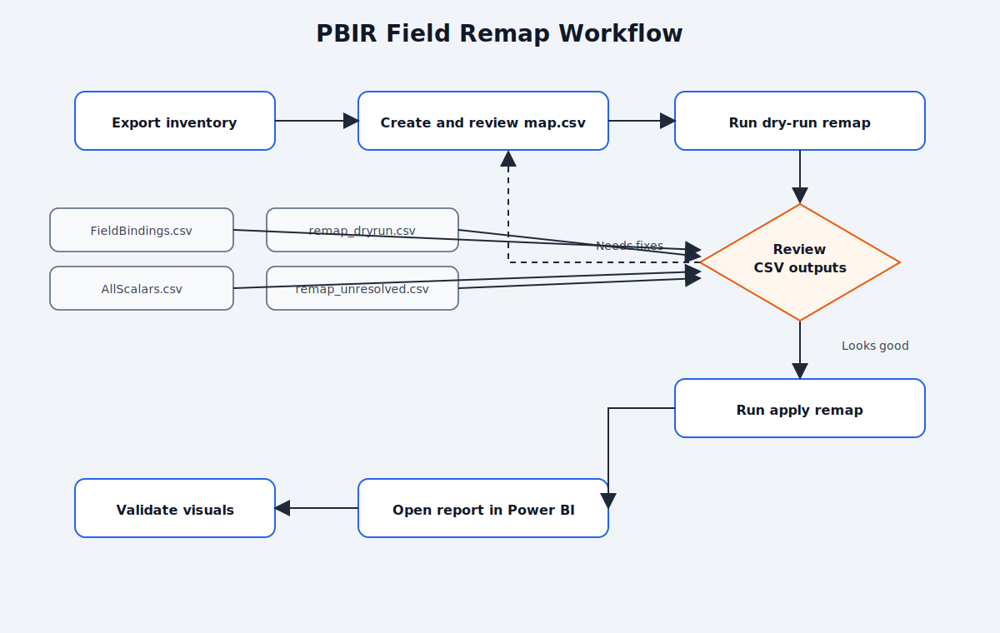

# PBIR Field Remap Toolkit

This folder contains scripts to analyze and remap semantic field references in a Power BI PBIR report.

## What is included

- `apply_field_remap.py`
  - Remaps report JSON field references using a CSV mapping file.
  - Supports dry-run and apply modes.
  - Supports a deep recursive mode (`--scan-all-json`) for nested/unknown JSON locations.

- `SKILL.md`
  - AI skill instructions for running the remap workflow safely.
  - Defines required inputs (`report_folder`, `mapping_csv`) and command templates.

- `export_report_json_inventory.py`
  - Exports report JSON inventory to CSV for analysis.
  - Useful to discover current bindings before building `map.csv`.

## Repository structure

- `apply_field_remap.py`
- `export_report_json_inventory.py`
- `README.md`
- `SKILL.md`

## Requirements

- Python 3.8+
- PBIR report folder ending with `.Report`
- Mapping CSV (`map.csv`) with columns:
  - `From Table`
  - `From col`
  - `To table`
  - `To col`

## Mapping rules

- Rows with blank `To table` or `To col` are skipped (original value is kept).
- Rows where source and target are identical are skipped (no-op).
- Mapping key is `(From Table, From col)`.

## Quick start

From this folder, run:

```powershell
python apply_field_remap.py "D:\path\to\MyReport.Report" --map "C:\path\to\map.csv" --dry-run
```

If the dry-run output looks correct, apply changes:

```powershell
python apply_field_remap.py "D:\path\to\MyReport.Report" --map "C:\path\to\map.csv" --apply
```

For deep coverage (recommended when visuals contain nested object expressions):

```powershell
python apply_field_remap.py "D:\path\to\MyReport.Report" --map "C:\path\to\map.csv" --dry-run --scan-all-json
python apply_field_remap.py "D:\path\to\MyReport.Report" --map "C:\path\to\map.csv" --apply --scan-all-json
```

## Graphical workflow



## Output files

By default, outputs are written to `<report_dir>/remap_output`:

- `remap_dryrun.csv` (dry-run mode)
- `remap_applied.csv` (apply mode)
- `remap_unresolved.csv` (references not found in map)

You can override output location:

```powershell
python apply_field_remap.py "D:\path\to\MyReport.Report" --map "C:\path\to\map.csv" --output-dir "D:\temp\remap_logs" --dry-run
```

## Inventory export usage

```powershell
python export_report_json_inventory.py "D:\path\to\MyReport.Report"
```

Default inventory output folder is `inventory_export` under the report directory:

- `FieldBindings.csv`
- `AllScalars.csv`

## Recommended workflow

1. Export inventory (`export_report_json_inventory.py`).
2. Build and review `map.csv`.
3. Run remap in dry-run mode.
4. Review `remap_dryrun.csv` and `remap_unresolved.csv`.
5. Run remap in apply mode.
6. Open report in Power BI Desktop and validate visuals/pages.

## Using the AI skill

The skill file is in this repository root as `SKILL.md`.

When using an AI assistant that supports skills, ask it to use this skill and provide:

1. `report_folder` (path to `.Report` folder)
2. `mapping_csv` (path to `map.csv`)

Example prompt:

```text
Use the PBIR field remap skill in SKILL.md.
report_folder: D:\Project\Git\Local\dsp_refactor\Global Programmatic Dashboard\Global Programmatic.Report
mapping_csv: C:\Users\Methun.Thirumurthy\Downloads\map.csv
Run dry-run first with --scan-all-json and show summary.
```

## Notes

- The script edits JSON files in-place when `--apply` is used.
- No automatic backup is created by the current version.
- Keep your own copy or use source control before apply, if needed.
