<picture>
  <source media="(prefers-color-scheme: dark)" srcset="assets/hero-dark.svg">
  
</picture>

<p>
  
  
  
  
  
</p>

Four Power BI projects that all treat the artefacts as **files rather than clicks**: two semantic models and reports kept as diffable text, a synthetic month of warehouse data written by a script, and two tools that bulk-edit PBIR and TMDL from a CSV.

| | | |
|---|---|---|
| 💸 | **[BigQuery + dbt Cost Observability](#-observability)** | Where the warehouse spend went, and which dbt model, test or hook spent it. **Runs offline** against a committed synthetic month — no cloud account. |
| 📼 | **[What's On Netflix](#-netflix)** | What the Netflix catalogue is made of, where it comes from, and when it arrived. **Live report — opens in a browser, no sign-in.** |
| 🔁 | **[PBIR Field Remap Toolkit](#-remap)** | Repoint every field reference in a report from one table or column to another, from a CSV. **Writes in place — commit first.** |
| 📄 | **[Semantic Model Descriptions](#-descriptions)** | Load field descriptions into a TMDL model from a CSV, as the `///` comments Desktop shows as tooltips. |

---

<a id="-observability"></a>
<picture>
  <source media="(prefers-color-scheme: dark)" srcset="assets/section-observability-dark.svg">
  
</picture>

A Power BI semantic model over BigQuery's own `INFORMATION_SCHEMA` job history, joined to `dbt_artifacts`. It answers the two questions cloud billing cannot: **where did the spend go**, and **which dbt node spent it**.

| | | |
|---|---|---|
| 📊 | **7 report pages** across query usage and dbt execution | interactive tabs, drillthrough to a single statement, and two Explore grids built on field parameters |
| 🧪 | **One synthetic month**, 4,894 jobs, $662.98 attributed | generated from a fixed seed by a stdlib-only script; no production data, and re-running reproduces the CSVs byte for byte |
| 🔌 | **One parameter switches the source** | `p_DataSource` takes the whole model from live BigQuery to the committed CSVs and back |

**[Read the full README →](Bigquery%20%26%20Dbt%20Cost%20Observability/README.md)** — architecture, every visual and the question it answers, the three-branch cost attribution, setup parameters, and the gotchas.

---

<a id="-netflix"></a>
<picture>
  <source media="(prefers-color-scheme: dark)" srcset="assets/section-netflix-dark.svg">
  
</picture>

A public Kaggle snapshot of the Netflix catalogue, turned into a semantic model and a three-view report. Three of its columns hold comma-separated lists rather than values, and getting past that is most of the work — a title filed under `Dramas, International Movies` cannot be grouped by genre until the list becomes rows.

| | | |
|---|---|---|
| 📼 | **8,804 titles, 122 countries, 42 genres** | genre and country split into their own rows, so the catalogue can be sliced by either without double-counting a title |
| 🔎 | **The library stopped growing in 2019** | films peaked at 1,424 added that year, series a year later at 595 — the two halves did not turn at the same time |
| ⚙️ | **One shared query, two grains** | the CSV is cleansed once and read by both a bridge table and a title-grain table; dropping an unused cast explosion cut the bridge **7.8×** with no number on the page changing |

**[Read the full README →](Netflix%20Dashboard/README.md)** — the dataset and its gaps, every transformation and the question it unlocks, the findings with their numbers, and the three "total titles" that all disagree and are all correct.

---

<a id="-remap"></a>
<picture>
  <source media="(prefers-color-scheme: dark)" srcset="assets/section-remap-dark.svg">
  
</picture>

Rename a column in the semantic model and every visual bound to it breaks, with nothing to tell you how many places are affected. Two Python scripts, no dependencies: one inventories every field reference, the other repoints them from a CSV.

| | | |
|---|---|---|
| 🔎 | **Inventory first** | a read-only pass found **257 bindings across 187 JSON files** in this repo's own report |
| 🔁 | **Rewrites the derived strings too** | `queryRef` and `selector.metadata` are rebuilt from the field pair, so they cannot disagree with it |
| 🔖 | **The deep scan is not optional** | it always runs, because the same 16 rules find **119 changes rather than 54** with it — and **62 of the extra 65 are inside 12 bookmark files** |

**[Read the full README →](PBIR%20Field%20Remap%20Toolkit/README.md)** — the CSV contract, every JSON location it rewrites, the output logs, and the ways it can bite you.

---

<a id="-descriptions"></a>
<picture>
  <source media="(prefers-color-scheme: dark)" srcset="assets/section-descriptions-dark.svg">
  
</picture>

Documenting a model in Desktop is a per-field click. One PowerShell script turns a CSV into the `///` comment lines TMDL actually stores — and TMDL has no `description:` property, so this is the only form that parses.

| | | |
|---|---|---|
| 📄 | **240 fields in one command** | 142 columns and 98 measures across 16 tables, in this repo's own model |
| ♻️ | **Safe to re-run** | existing comments are replaced in place, never stacked, so the CSV stays the source of truth |
| 🔒 | **Writes UTF-8 without a BOM** | a BOM in a PBIP file makes Desktop refuse to open the project |

**[Read the full README →](Semantic%20Model-Descriptions%20Mapping/README.md)** — the CSV contract, what it writes, and the ways it can report success while having done nothing.

---

## 📚 Reference

Everything below is reference — read it when you need it.

### 📁 Repo layout

```
PowerBi/
├─ Bigquery & Dbt Cost Observability/   PBIP project, synthetic data, generators
├─ Netflix Dashboard/                   PBIP project, Kaggle CSV, page captures
├─ PBIR Field Remap Toolkit/            inventory + remap scripts, agent skill
├─ Semantic Model-Descriptions Mapping/ TMDL description loader, agent skill
├─ scripts/                             this page's SVG generator and its specs
└─ assets/                              this page's light/dark SVGs
```

Each project folder is self-contained: its own README, its own assets, no shared code. The `&` in the first folder name is a shell operator, so **quote the path** in any command you run against it.

### 🤖 Agent skills

Both toolkits ship a `SKILL.md` describing their workflow for an assistant that supports skills — required inputs, validation gates, and what to report back. They are instructions for driving the scripts, not a second implementation of them.

### 📄 Licence

[Apache-2.0](LICENSE). The synthetic data is synthetic: no production data, table names or addresses appear anywhere in this repository.
