<picture>
  <source media="(prefers-color-scheme: dark)" srcset="assets/hero-dark.svg">
  
</picture>

<p>
  
  
  
  
  
</p>

One PowerShell script that takes a CSV of field descriptions and writes them into a **TMDL** semantic model as `///` documentation comments — the ones Power BI Desktop shows as tooltips in the field list. Bulk documentation, in the format the model actually stores.

| | | |
|---|---|---|
| 📄 | **[Step 1 · Build the CSV](#-step-1)** | Four columns, matched exactly. Generating it from the model beats typing it. |
| ▶️ | **[Step 2 · Run it](#-step-2)** | One command. Safe to re-run — it replaces descriptions rather than stacking them. |
| ⚠️ | **[Step 3 · How it fails quietly](#-step-3)** | It never errors on a field it cannot find. This is the section that matters. |

---

## 🎯 The three problems it solves

| 1️⃣ Descriptions are a per-field click | 2️⃣ TMDL has no `description:` property | 3️⃣ Documentation drifts from the model |
|---|---|---|
| Documenting a model in Desktop means selecting each field and typing into the properties pane. For the model in this repo that is **240 fields across 16 tables** — 98 measures and 142 columns. | The obvious guess is wrong. TMDL stores documentation as `///` comment lines above the declaration, and writing a `description:` property makes Desktop refuse to parse the file. | Descriptions written by hand in Desktop live only in the model. A CSV lives in source control next to it, can be reviewed, and can be reapplied after the model is rebuilt. |
| One CSV, one command, all 240. | The script writes the `///` form, which is the only one TMDL accepts. | Re-running replaces existing comments in place, so the CSV stays the source of truth. |

---

<a id="-step-1"></a>
<picture>
  <source media="(prefers-color-scheme: dark)" srcset="assets/section-csv-dark.svg">
  
</picture>

Four columns. The header is matched exactly, and every value is compared **case-sensitively against the model** except `Field Type`:

```csv
Table Name,Field Name,Field Type,Description
dim_Customer,CustomerKey,Column,Unique identifier for customer records.
Measure,Billed Amount $,Measure,On-demand cost of the bytes billed.
Fact,Cache State,Calculated Column,Whether the job was served from cache.
```

| Column | Must be | Notes |
|---|---|---|
| `Table Name` | the `.tmdl` **filename** without the extension | matched as a filename, so a table whose file is `dbt_models.tmdl` is `dbt_models`. A missing file warns and skips the whole group. |
| `Field Name` | the column or measure name as declared | quoted names in TMDL (`measure 'Billed Amount $'`) are given **without** the quotes here |
| `Field Type` | `Measure`, or anything else | `Measure` selects a TMDL `measure` declaration; `Column`, `Calculated Column` and `Field Parameter` all select a `column`. Compared case-insensitively. |
| `Description` | the text | may contain line breaks; each becomes its own `///` line, and blank lines are dropped |

See [`sample-descriptions.csv`](sample-descriptions.csv) for a template.

> [!TIP]
> Do not type the names. Every declaration in a TMDL model is a line matching `^\t(column|measure)\s+`, so the field list can be generated from `definition\tables\*.tmdl` directly — read the files as **bytes** and split on `` `r`n ``, because PowerShell's and Python's text readers both normalise line endings and will hide what the script actually sees.

---

<a id="-step-2"></a>
<picture>
  <source media="(prefers-color-scheme: dark)" srcset="assets/section-run-dark.svg">
  
</picture>

```powershell
.\Add-PBIRDescriptions.ps1 `
    -SemanticModelPath "D:\Path\To\YourModel.SemanticModel" `
    -CsvPath "C:\Path\To\descriptions.csv"
```

<picture>
  <source media="(prefers-color-scheme: dark)" srcset="assets/cast-run-dark.svg">
  
</picture>

That run is against the semantic model in this repo, which this script had already documented — so all 240 fields were **replaced** rather than inserted. On a fresh model the same run reports 240 inserted, 0 replaced.

| Summary line | Means |
|---|---|
| **Descriptions inserted** | the declaration had no `///` comment above it and one was added |
| **Descriptions replaced** | it already had one, which was removed and rewritten — this is what a re-run looks like |
| **Fields not found** | the CSV row matched no declaration, **or** its whole table file was missing. Any number here other than zero is a problem to investigate, not a rounding error. |

### What it writes

Before:

```tmdl
	column CustomerKey
		dataType: int64
```

After:

```tmdl
	/// Unique identifier for customer records.
	column CustomerKey
		dataType: int64
```

A multi-line `Description` becomes consecutive `///` lines. Files are written back as **UTF-8 without a BOM** with **CRLF** preserved — which matters, because a BOM in a PBIP file makes Power BI Desktop refuse to open the project. Only tables that changed are written at all.

> [!IMPORTANT]
> The model must be saved in **TMDL** format — a `definition\tables\` folder of `.tmdl` files, not a single `model.bim`. Enable it in Desktop under *File → Options → Preview features → "Store semantic model using TMDL format"*, and save the project before running. Close the file in Desktop first: Desktop holds the model in memory and will write its own version back over yours when it saves.

---

<a id="-step-3"></a>
<picture>
  <source media="(prefers-color-scheme: dark)" srcset="assets/section-reference-dark.svg">
  
</picture>

Everything below is reference — read it when you need it.

<a id="-things-that-will-bite-you"></a>
### ⚠️ Things that will bite you

| | |
|---|---|
| **An LF-only model matches nothing, silently** | The file is split on `` `r`n `` only. Point the script at a model whose `.tmdl` files use bare LF — one that has been through a tool that normalised line endings, or a `.gitattributes` that checks out LF — and **every row reports `[NOT FOUND]`, no file is written, and the script still completes successfully.** Measured: 240 of 240 rows missed on an otherwise identical model. Desktop writes CRLF, so this bites on round-tripped models, not fresh ones. |
| **A bad `Field Type` reads as a column** | Only the value `Measure` (any casing) selects a `measure` declaration. Anything else — `Metric`, a typo, a blank — silently searches for a **column** of that name and reports the field as not found. The Field Type is never validated. |
| **Nothing fails the build** | Every miss is a PowerShell warning and a line in the summary. There is no non-zero exit and no `-Strict` switch, so a run that documented nothing looks like a run that documented everything unless you read the counts. Check `Fields not found` every time. |
| **No backups, and it edits in place** | There is no dry-run and no backup. Commit the model first. |
| **Names are case-sensitive against the model** | `Table Name` is matched as a filename and `Field Name` via a regex built from the CSV value, so `customerkey` will not match `CustomerKey`. Only `Field Type` is forgiving. |
| **Only columns and measures** | The regex matches `column` and `measure` declarations indented with exactly one tab. Tables themselves, hierarchies, hierarchy levels, partitions and roles are not reachable — a CSV row naming one is reported as not found. |
| **First match in the file wins** | The search stops at the first matching declaration. Two declarations of the same name in one table file would only ever see the first, though a valid model cannot contain that. |
| **The per-table count includes misses** | `[SAVED] Fact.tmdl (40 field(s) processed)` reports the number of CSV rows *for that table*, not the number that matched. The Summary block is the count that tells you what happened. |
| **Field parameters are ordinary columns here** | `Field Parameter` is accepted as a `Field Type`, but only because it maps to `column` like everything non-Measure. The description lands on the column declaration inside the field-parameter table. |

### 🧪 Reproducing the figures on this page

The run shown above was against a copy of this repo's own semantic model, with a CSV generated from its declarations:

```powershell
$model = "..\Bigquery & Dbt Cost Observability\powerbi\BigQuery dbt Cost Observability.SemanticModel"
# 240 declarations: 142 column, 98 measure, across 16 .tmdl files
.\Add-PBIRDescriptions.ps1 -SemanticModelPath $model -CsvPath descriptions.csv
```

Generate the CSV by scanning `$model\definition\tables\*.tmdl` for lines matching `^\t(column|measure)\s+('([^']+)'|[^\s=]+)`, reading each file as bytes and splitting on `` `r`n ``.

### 📁 Repo layout

```
Semantic Model-Descriptions Mapping/
├─ Add-PBIRDescriptions.ps1     the script
├─ sample-descriptions.csv      four-column template
├─ SKILL.md                     agent instructions, CSV contract, troubleshooting
└─ assets/                      light/dark SVGs and the captured run
```

### 🤖 Using it through an agent

[`SKILL.md`](SKILL.md) documents the same workflow for an assistant that supports skills: it asks for the model path and the CSV path, validates both, warns that existing descriptions will be replaced, and reports the three summary counts.

<sub>Part of <a href="../README.md">methunt/PowerBi</a> · Apache-2.0</sub>
